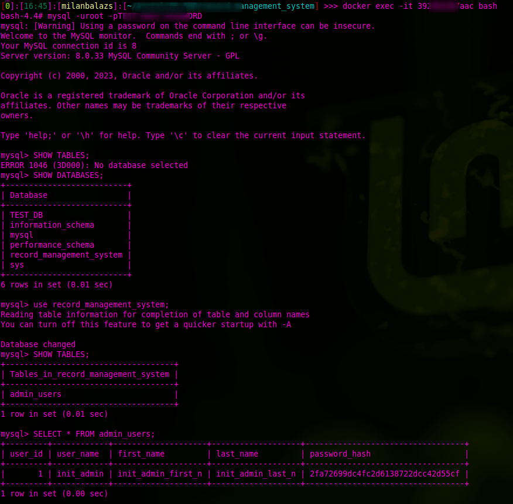

# University project - Record Management System

It's a Management System of car shop. The users can browse the available cars and their details. The Administrators can modify/add/delete the records (cars) in the service.

## Requirements

In this section you can read the requirements based on the permissions levels.

### User requirements

- Users should be able to browse the available cars
- Users shouldn't be able to modify/add/delete the records (cars)
- Users don't have profile and log-in is not needed to browse the cars
- Users can registrate as Admin the the request has to be approved by another Admin user

### Administrator requirements

- Admins should be able to browse the available cars
- Admins should be able to log-in to the application
- Admins should be able to approve/delete the registration requests
- Admins should be able to modify/add/delete the records (cars)

## Prerequisites

The application is runnin in separated `Docker containers` so only the Docker/Docker-compose has to be installed to the PC.

**Official Docker installation documentation:**

- https://docs.docker.com/engine/install/

**Official Docker-compose installation documentation:**

- https://docs.docker.com/compose/install/

## Configuration

The configuration file is available in the root-folder of the application (`environment_config.sh`).

**Content of the configuration file:**

- MYSQL_ROOT_PASSWORD - Root password of the MySQL DB (You can use this password for the root user in the MySQL).
- MYSQL_DATABASE - The initial DataBase. It's not used currently in the application but in the future it can be used.
- MYSQL_USER - The user of the MySQL DB.
- MYSQL_PASSWORD - Password of the created user in MySQL DB.

**Note:**

- The configuration parameters are not visible on the `host` or on the user side. Only the admin/developer can see who perform the deployment of the application.

## Deployment

The deployment is contenerized (`Docker` and `docker-compose`) and it's platform independent.

The deployment is automatized and it can be done to run the `deploy.sh` scipt from the root-folder. The script sources the configuration (Previous section) and deploy the application based on the `docker-compose.yml` file (In the root folder).

**Reference of docker-compose:**

- https://docs.docker.com/compose/compose-file/

## Tested Environment:

**Operation System:**

- Linux Mint - 19.1 (Tessa)

**Docker version:**

- Client - 23.0.1 ; API version: 1.42
- Server - 23.0.1 ; API version: 1.42

**Docker-compose version:**

- 1.29.1

## App - `PHP`

## `MySQL`

**The used `MySQL` base `Docker Image`:**

- [8.0.33](https://hub.docker.com/layers/library/mysql/8.0.33/images/sha256-13e429971e970ebcb7bc611de52d71a3c444247dc67cf7475a02718f6a5ef559?context=explore) (You can find here the parameters/configs)

The application uses custom `Docker Image` which can be found:

- [build/mysql/Dockerfile](build/mysql/Dockerfile)

The own `Docker Image` is useful because we won't reach the pull-rase limit in the official `Docker Registry`. Furthermore we can change/extend/modify the original `Docker Image`.

### Create the init state of `MySQL` DB

**[init.sql](build/mysql/init.sql)**:

- Create `record_management_system` DataBase if it doesn't exist.
- Create `admin_users` table if it doesn't exist.
  - `user_id` int(11) NOT NULL auto_increment (Primary Key) - The ID of the user. It's auto-incremented
  - `user_name` varchar(250) NOT NULL default '' - The name of the user. It can be used to log-in to the application
  - `first_name` varchar(250) NOT NULL default '' - First name of the user.
  - `last_name` varchar(250) NOT NULL default '' - Last name of the user.
  - `password_hash` varchar(250) NOT NULL default '' - The password of the user. It's an MD5 hash.
  - `approved` int(1) NOT NULL default 0 - If it's 0 then the registration is not approved by another administrator (Login/Usage is not allowed).
- Create initial admin user
  - `user_name`: 'init_admin'
  - `first_name`: 'init_admin_first_n'
  - `last_name`: 'init_admin_last_n'
  - `password_hash`: '2fa72699dc4fc2d6138722dcc42d55cf' (init_admin_password) (MD5)
- Create `cars` table if it doesn't exist.
  - `car_id` int(11) NOT NULL auto_increment (Primary Key) - The ID of the user. It's auto-incremented
  - `car_type` varchar(250)  NOT NULL default '' - Type of the car
  - `car fuel` varchar(250)  NOT NULL default '' - Fuel of the car
  - `car_year` date  NOT NULL - The produce year of the car
  - `car_seats` varchar(250)  NOT NULL default '' - Number of the seats in the car
  - `car_price` int(10)  NOT NULL default 0 - The price of the car (The currency is not specified)
- Create initial car in `cars` table
  - `car_type`: 'Audi A8'
  - `car fuel`: 'Diesel'
  - `car_year`: '1990-12-12'
  - `car_seats`: 5
  - `car_price`: 15000

**`admin_users` table ER diagram:**

**`cars` table ER diagram:**

The script is able to handle if the databases or tables are available (persistent volume is set for `Docker Service`) so it creates them only in case if they are not available.

The above `SQL` script is copied to the `MySQL Docker image` to the `/docker-entrypoint-initdb.d` folder. In this folder the `*.sql` and `*.sh` script are ran automatically by MySQL in the start-up phase.

It means in the first usage you can use the above admin user credentials (I highly recommend to change the password of it after first usage.).

### Init state verification

Enter to the MySQL container:

- `docker exec -it <docker_container_id> mysql -uroot -p<root_password>`
- `use record_management_system;`
- `SELECT * FROM admin_users;`

## Security stuff

- There is no open port for `MySQL` service. It's accissable only inside the `Docker network`.
- Only 80 port is open for `PHP` service.
